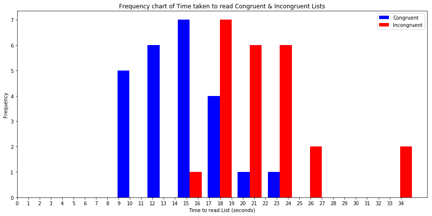

### Analyzing the Stroop Effect
Perform the analysis in the space below. Remember to follow [the instructions](https://docs.google.com/document/d/1-OkpZLjG_kX9J6LIQ5IltsqMzVWjh36QpnP2RYpVdPU/pub?embedded=True) and review the [project rubric](https://review.udacity.com/#!/rubrics/71/view) before submitting. Once you've completed the analysis and write-up, download this file as a PDF or HTML file, upload that PDF/HTML into the workspace here (click on the orange Jupyter icon in the upper left then Upload), then use the Submit Project button at the bottom of this page. This will create a zip file containing both this .ipynb doc and the PDF/HTML doc that will be submitted for your project.


### 1. What is the independent variable? What is the dependent variable?

* There are 2 independent variables - a congruent words condition, and an incongruent words condition.

* The dependent variable is time taken to name the ink colors in equally-sized Congruent & Incongruent lists.

### 2. What is an appropriate set of hypotheses for this task? Specify your null and alternative hypotheses, and clearly define any notation used. Justify your choices.

* Since same set of participants will go through and record time for same set of congruent & incongruent words, resulting in pairs of observations , mean time should be used to compare and dependent samples t-test should be performed


**Null Hypothesis H_0 - No difference in mean time taken to read congruent and incongruent list**

**Alternate Hypothesis H_1 - Mean time to read incongruent list is greater than mean time to read** congruent list

 * H_0 : μ_ic = μ_c

 * H_1 : μ_ic > μ_c

 Where μ_ic is mean time taken to read incongruent list and μ_c is mean time taken to read congruent list

### 3. Report some descriptive statistics regarding this dataset. Include at least one measure of central tendency and at least one measure of variability. The name of the data file is 'stroopdata.csv'.

**Import required libraries**


```python
import matplotlib
import numpy as np
import pandas as pd
from scipy import stats
import matplotlib.pyplot as plt

```

**Load .csv file to read dataset**


```python
# Import csv file
df=pd.read_csv('stroopdata.csv')

```

**Print information about given Dataset**


```python
print('Number of rows in dataset :: ',df.shape[0])
print('Number of columns in dataset :: ',df.shape[1])
#find no of columns and non-empty fields in dataset
print('dataset information :: ')
df.info()
```

    Number of rows in dataset ::  24
    Number of columns in dataset ::  2
    dataset information ::
    <class 'pandas.core.frame.DataFrame'>
    RangeIndex: 24 entries, 0 to 23
    Data columns (total 2 columns):
    Congruent      24 non-null float64
    Incongruent    24 non-null float64
    dtypes: float64(2)
    memory usage: 464.0 bytes


** There are 2 columns in given dataset: Congruent , Incongruent and It has 24 rows of data which means there are 24 individual participants . There are no non-null values which means Both columns are of equal size and no need to remove rows with atleast one null value. Data type for storing Time taken to read Congruent & Incongruent lists is float. **


**Print few rows in Dataset**


```python
df.head()
```


<div>
<style scoped>
    .dataframe tbody tr th:only-of-type {
        vertical-align: middle;
    }

    .dataframe tbody tr th {
        vertical-align: top;
    }

    .dataframe thead th {
        text-align: right;
    }
</style>
<table border="1" class="dataframe">
  <thead>
    <tr style="text-align: right;">
      <th></th>
      <th>Congruent</th>
      <th>Incongruent</th>
    </tr>
  </thead>
  <tbody>
    <tr>
      <th>0</th>
      <td>12.079</td>
      <td>19.278</td>
    </tr>
    <tr>
      <th>1</th>
      <td>16.791</td>
      <td>18.741</td>
    </tr>
    <tr>
      <th>2</th>
      <td>9.564</td>
      <td>21.214</td>
    </tr>
    <tr>
      <th>3</th>
      <td>8.630</td>
      <td>15.687</td>
    </tr>
    <tr>
      <th>4</th>
      <td>14.669</td>
      <td>22.803</td>
    </tr>
  </tbody>
</table>
</div>


**Calculating central tendency & measure of variability **

* The mean, median and mode are used to measure central tendency of data set
* The Standard deviation, quantile Range and variance are used to measures variability of data set


```python

Congruent_data = df['Congruent']
Incongruent_data = df['Incongruent']
C_Mean=np.mean(Congruent_data)
IC_Mean=np.mean(Incongruent_data)
C_Median=np.median(Congruent_data)
IC_Median=np.median(Incongruent_data)
C_Mode=stats.mode(Congruent_data)[0]
IC_Mode=stats.mode(Incongruent_data)[0]
C_Std_dev=np.std(Congruent_data)
IC_Std_dev=np.std(Incongruent_data)
C_Variance=Congruent_data.var()
IC_Variance=Incongruent_data.var()

print('Congruent Mean               :: ',C_Mean,'  Incongruent Mean   ::',IC_Mean)
print('Congruent Median             :: ',C_Median,'             Incongruent Median ::',IC_Median)
print('Congruent Mode               :: ',C_Mode,'              Incongruent Mode   :: ',IC_Mode)
print('\nCongruent Standard Deviation :: ',C_Std_dev,'   Incongruent Standard Deviation ::',IC_Std_dev)
print('\nQuantile Range :: ')
print(df.quantile([.25, .5, .75]))
print('\nCongruent Variance :: ',C_Variance,'            Incongruent Variance :: ',IC_Variance)
```

    Congruent Mean               ::  14.051125000000004   Incongruent Mean   :: 22.01591666666667
    Congruent Median             ::  14.3565              Incongruent Median :: 21.0175
    Congruent Mode               ::  [8.63]               Incongruent Mode   ::  [15.687]

    Congruent Standard Deviation ::  3.4844157127666326    Incongruent Standard Deviation :: 4.696055134513317

    Quantile Range ::
          Congruent  Incongruent
    0.25   11.89525     18.71675
    0.50   14.35650     21.01750
    0.75   16.20075     24.05150

    Congruent Variance ::  12.669029070652174             Incongruent Variance ::  23.011757036231884


### 4. Provide one or two visualizations that show the distribution of the sample data. Write one or two sentences noting what you observe about the plot or plots.


```python
# Build the visualizations here
plt.figure(figsize=(15,7))
plt.hist([Congruent_data, Incongruent_data], color=['blue', 'red'])
legend = ['Congruent', 'Incongruent']
plt.xlabel('Time to read List (seconds)')
plt.ylabel('Frequency')
plt.xticks(range(0,35))
plt.legend(legend)
plt.title('Frequency chart of Time taken to read Congruent & Incongruent Lists')
plt.show()


```





* From above figure we can see that both plots are skewed. Incongruent list is taking more time than Congruent list
* Congruent List read time is centered in between 14 to 15.5 seconds
* Incongruent List read time is centered in between 18 to 19 seconds
* Least frequency for Congruent list is around 20 seconds
* Least frequency for Incongruent list is around 16 seconds

### 5. Now, perform the statistical test and report your results. What is your confidence level or Type I error associated with your test? What is your conclusion regarding the hypotheses you set up? Did the results match up with your expectations? **Hint:**  Think about what is being measured on each individual, and what statistic best captures how an individual reacts in each environment.

Calculate Mean Difference of Congruent & Incongruent List


```python
# Perform the statistical test here
Mean_Diff= IC_Mean - C_Mean
print('Mean Difference :: ',Mean_Diff)
```

    Mean Difference ::  7.964791666666665


Calculate Standard deviation Difference of Congruent & Incongruent List


```python
# Perform the statistical test here
Std_Dev_Diff=(Incongruent_data-Congruent_data).std()
print('Standard Deviation Difference :: ',Std_Dev_Diff)
```

    Standard Deviation Difference ::  4.864826910359056


t_statistic is (Mean difference)/(Standard Deviation difference/square root of Dataset length))


```python
t_statistic=Mean_Diff/(Std_Dev_Diff/np.sqrt(len(df)))
print('t_statistic :: ',t_statistic)
```

    t_statistic ::  8.020706944109955


t_critical value for a 90% confidence level and (no of participants-1) d.f.


```python
stats.t.ppf(.90, len(df)-1)
```


    1.3194602391408932


From above analysis we can say that t_statistic > t_critical . So we can reject the Null Hypothesis H_0  that there is no difference in mean time taken to read congruent and incongruent list

### 6. Optional: What do you think is responsible for the effects observed? Can you think of an alternative or similar task that would result in a similar effect? Some research about the problem will be helpful for thinking about these two questions!

* I think it takes more time to read list in incongruent words condition compared to congruent words condition because mismatch of name of the color and color of the word can cause high probability of errors compared to words of same name and color.
* A similar task would be comparing time taken to complete a marathon without training and with training.with training anyone would perform slightly better than without training
